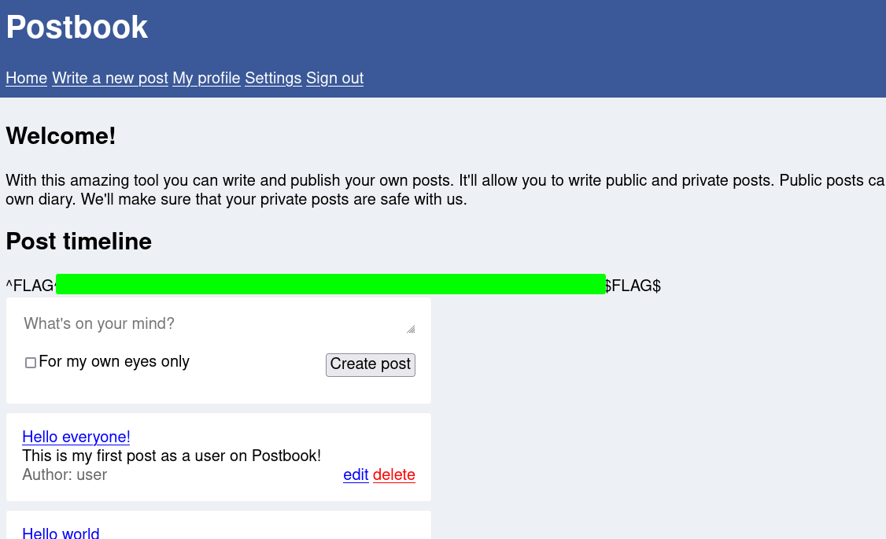
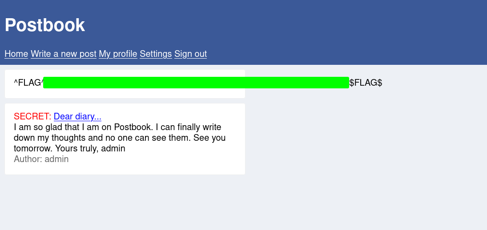
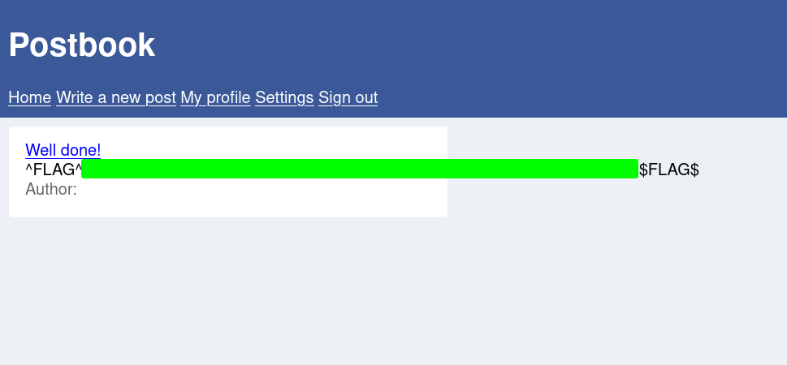
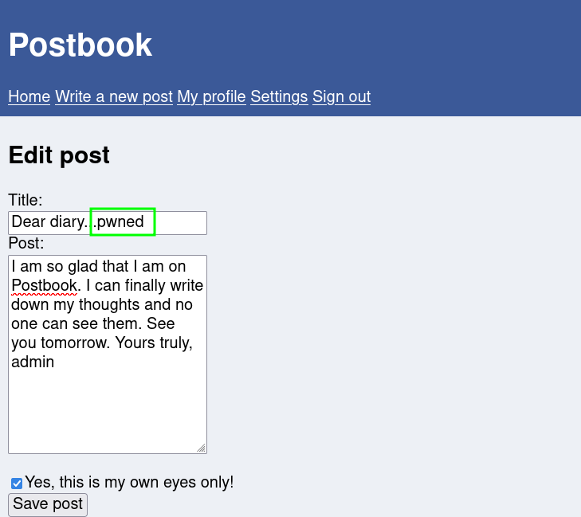
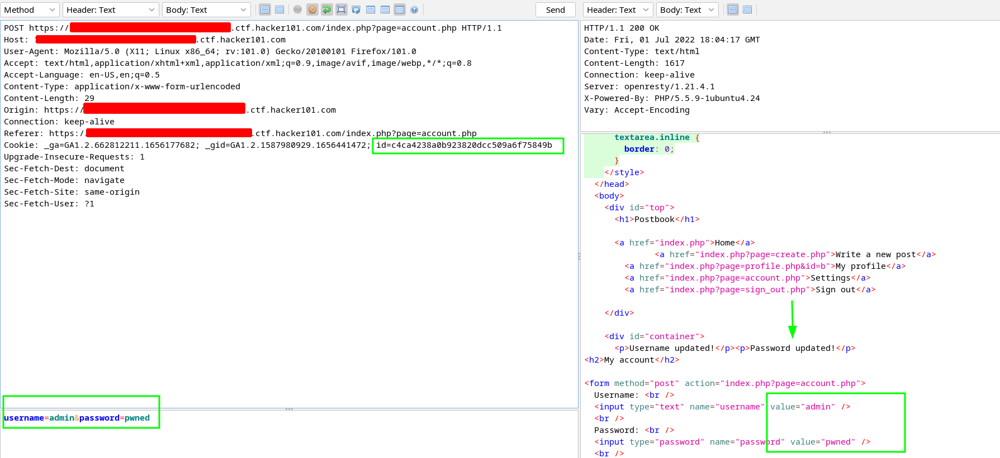
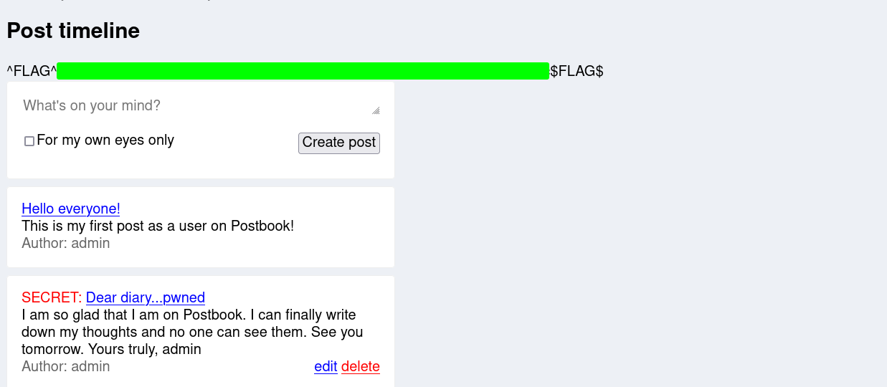
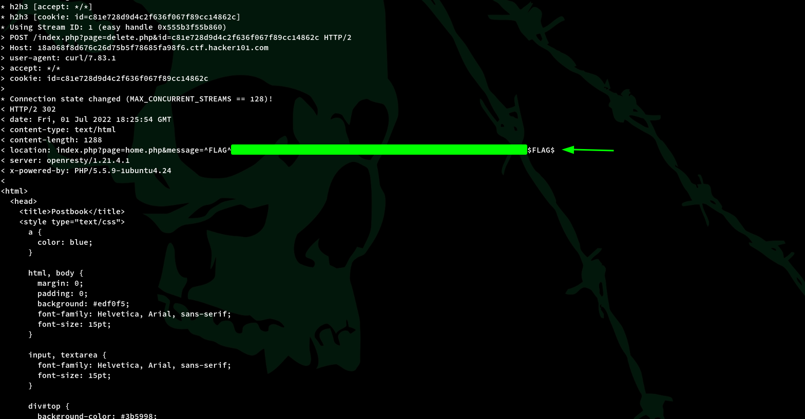

# This is a write up on hacker101 CTF "Postbook" challenge

### Difficulty : Easy | Skills : Web | Name : Postbook


### Lets get started


### Flag0 --  Found

- The person with user name "user" has a very easy password...


**Solution:**

User name "user" password   "xxxxxxxx".  Brute force will do the job. Use any tool you like Ffuf, Zaproxy or Burp suite ( I will have to warn you, that  the burp suite community edition intruder is crazy slow!!) . I will use  zaproxy since it is my favorite.  


Intercept the login request and open it in the fuzzer tap. Choose the "password" parameter and set the payload (Any password list will do the job).This list will do the job for this challenge.

```bash
123456
12345678
qwerty
123456789
password
12345
1234
111111
1234567
dragon
123123
baseball
abc123
football
```


 

Start the fuzzer and you want to keep an eye on the response-length and HTTP code columns. The response length of a logged-in page is not the same as an error response page (In this case). The  correct password will stick out from the others with a unique response length and 302 HTTP code. 




Log in to get the flag.

### Flag1 -- Found

- Try viewing your own post and then see if you can change the ID


**Solution:**




When viewing a post. The site take you to a "view" endpoint that take an  "id" parameter. So naturally when I saw the id parameter I changed the parameter value from id=3 to id=2 . Which displayed a private post written by the admin and gives the flag.

### Flag2 -- Found

- You should definitely use "Inspect Element" on the form when creating a new post


**Solution:**


When creating a new post. I noticed that when I choose the private posting feature, there is a  hidden input tag  with id=2. So I captured the post request and changed the "id" parameter into id=1. The response contained the flag.


### Flag3 --  Found

- 189 * 5 


**Solution:**




> URL : https://xxx.ctf.hacker101.com/index.php?page=view.php&id=945

I was sure that the number "945" have no value and I need to inject it in some parameter. First attempt wast to inject it to "view=945" parameter and it responded with a buffer that contained the flag.


### Flag4 -- Found

- You can edit your own posts, what about someone else's?


**Solution:**




> URL : https://xxx.ctf.hacker101.com/index.php?page=edit.php&id=1

I noticed that when I edit my post  there was an id parameter  in the page URL. So I changed it to id=1 and I got access to the admin edit post buffer. 

Edited the title and  saved the post. The page showed the flag.


### Flag5 --  Found

- The cookie allows you to stay signed in. Can you figure out how they work so you can sign in to user with ID 1?


**Solution:**

So now I know that the admin cookie value "1". The change password and user name  feature is carried out by the  the "account.php" file which only need an authenticated cookie. So from the user account I sent a request and intercepted it.




 Then I change the "id" cookie to the MD5 hash for number "1" which is   **c4ca4238a0b923820dcc509a6f75849b** . Since there is no CSRF token or any other type of authorization tokens the request was accepted and I was able to change the admin's password. Signed in to the admin account and The flag was waiting for me there.





### Flag6 --  Found

- Deleting a post seems to take an ID that is not a number. Can you figure out what it is?


**Solution:**

They are MD5 hashes same as in the cookies. Using crack station I found that each one correspond to a number. The delete parameter takes an MD5 hash while the view paramter take an integer number so from the view post page  we can see that the admin post id=1.

 I intercepted a delete post request that was initiated by the user account.  I encoded number 1 with MD5 hash and changed the id. In the respond I received the flag from zap inform of a pop up and for some reason i was not able to copy the flag.

So i used curl to make a POST  request and it worked i received the flag in the response. 

```bash
 curl 'https://xxxxxxxxxxx.ctf.hacker101.com/index.php?page=delete.php&id=c81e728d9d4c2f636f067f89cc14862c' -v  -X POST -b 'id=c81e728d9d4c2f636f067f89cc14862c'

# -X POST is the Http method
# -v for verbos mode
# -d to add the cookie for the request. In this case i added the user cookie. it is important because  if the request had the admin cookie. then it would be a normal delete request.

```

- Replace the URL with your URL and the "id=" parameter with the MD5 hash of the id number of the post to delete.




That's it for the challenge. Hope you learned something. Obviously we did not perform any advanced attacks and techniques.  Using curiosity and  basic web and networking knowledge was enough for this challenge. 
