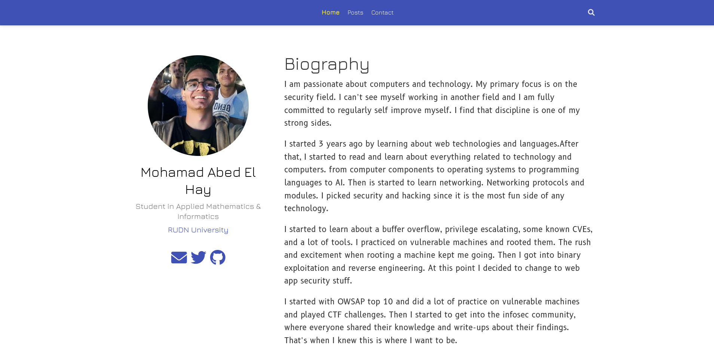
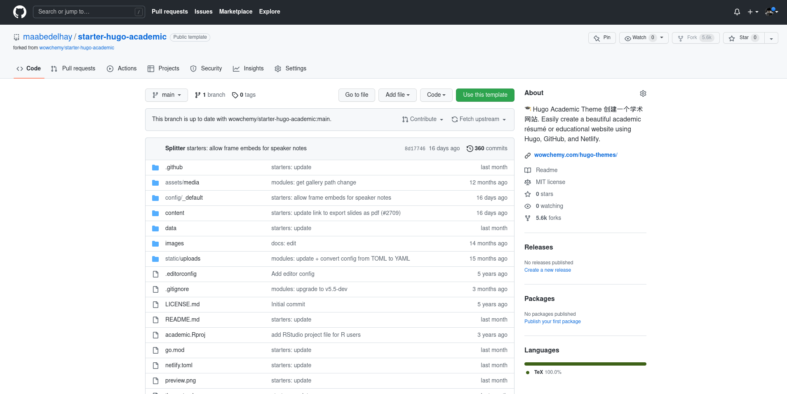
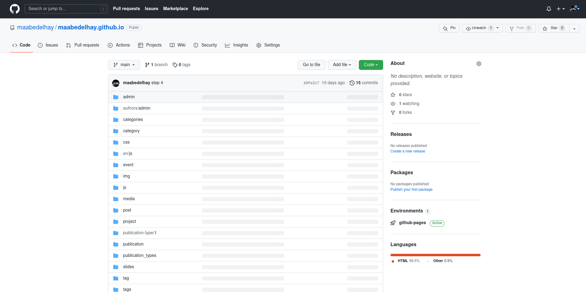

# Обзор

Цель проекта - сделать персональный сайт, размещенный в Интернете. Три основных компонента этого сайта — это генератор статического сайта Hugo, академический шаблон wowchemy и хостинг GitHub.

Главная страница сайта содержит мою фотографию профиля, биографию, информацию об образовании, навыках, опыте и мои сообщения.

## Хьюго
Генератор статического сайта берет ваш контент, применяет его к шаблону и создает статический сайт на основе HTML. Он отлично подходит для блогов и целевых страниц.

- Преимущества:

   - Быстрое развертывание
   - Безопасный (без динамического содержимого)
   - Быстрое время загрузки
   - Простое использование
   - Управление версиями

Чтобы начать с Hugo, сначала я скачал [последнюю версию] (https://github.com/gohugoio/hugo/releases) Hugo. Затем я создал новый репозиторий, клонированный из академического шаблона Wowchemy. После клонирования репозитория и создания нового репозитория для размещения сайта. Я создал сайт с помощью Hugo.

## Вовхимия

Академический шаблон Wowchemy Hugo помогает создать сайт и предоставить нам необходимый файл, чтобы мы могли настроить его и работать над ним.

Просто клонируйте [шаблон] (https://github.com/maabedelhay/starter-hugo-academic) в качестве нового репозитория.

## Гитхаб

Бесплатный хостинг GitHub является основным, позволяющим нам размещать сайт в Интернете. создав репозиторий в виде username.github.io. В этом репозитории код сайта.

## Этот проект помог мне понять, как работает хостинг GitHub. Как важно иметь личный блог, который побуждает вас публиковать свои работы и идеи.
